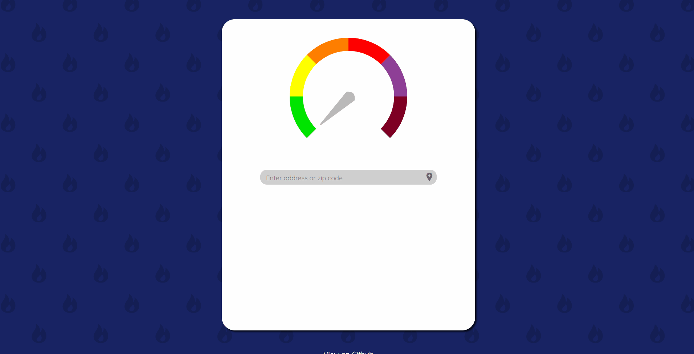

# Air Quality Visualizer

Air Quality Visualizer is a simple view of air quality data mostly focusing around California. View the live site [here](https://pensive-brahmagupta-1d2112.netlify.app/)!

## Overview

The Air Quality Visualizer was originally built when there were massive wildfires in California, and the air quality was difficult to keep track of. I wanted a way to view the air quality at a glance, and created this site to do just that. It includes a visualizer created with Javascript and CSS. This was also one of my first experiences using React, so developing individual components was my main focus.

## How I built it

Technologies Used:

- React
- HTML
- JSX
- CSS

In addition, I pulled the data from the API that you can find [here](http://www.airnowapi.org).

## Future Developments

In the future I hope to take advantage of the users location to automatically show them statistics for their area.
